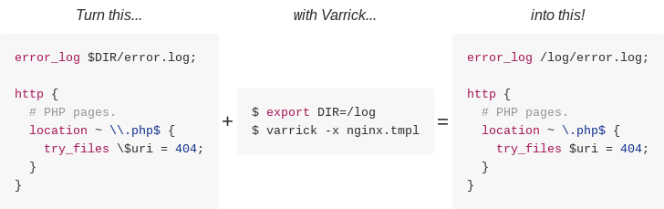

# Varrick

[](https://raw.githubusercontent.com/ztombol/varrick/master/COPYING)
[](https://travis-ci.org/ztombol/varrick)

Varrick is a convenient template engine written in shell script and built around
[`envsubst`][envsubst-hp]. It substitutes references of the form `$var` and
`${var}` with environment variables and supports escaping among other advanced
features.



Varrick was developed to simplify configuration of Linux containers, but can be
used for other purposes as well.


# Motivation

Configuration files are often generated by replacing default values with
environment variables using `sed`. This is tedious and error prone in all but
the simplest cases.

A number of shell scripts attempt to remedy the situation and hide the gory
details of this process. They use `sed` or `eval`, which are ill-suited to
implement substitution, and end up cutting corners to avoid complexity. The
resulting esoteric, mostly undocumented behaviour is left to the user to figure
out. Often a purpose built `sed`-based solution is a more viable option. Not
very convenient.

Good template engines exist in higher level languages, e.g. Perl or Python, but
their dependencies are too heavy to be considered for containers.

Existing solutions are either not robust enough to provide consistent behaviour
outside the simplest cases or require large dependencies. This is what Varrick
intends to change.


# Design

Varrick was designed to be...

- **Convenient** - Consistent, intuitive and well-documented behaviour across
  all user input.
- **Lightweight** - Avoid using heavy dependencies, but don't reinvent the
  wheel.

To achieve this, Varrick is...

- **Implemented in shell script.** Supported shells are already available on
  most systems and containers.
- **Using [`envsubst`][envsubst-hp] for substitution.** Most problems of
  existing shell-based solutions come from the fact that they use the wrong tool
  for the job. `envsubst` was made solely to substitute environment variables in
  shell format strings. It is part of `gettext`, which is readily available on
  most systems and containers.
- **Thoroughly tested.** All code tested using [Bats][bats-gh]. Libraries are
  unit tested.
- **Well-documented.** Concise user and developer documentation, well-commented
  source.


# Examples

## Simple variable expansion

Paths can contain a wide range of characters, which makes them especially
difficult to reliably substitute using `sed`. Thanks to `envsubst`, Varrick will
just *do the right thing* regardless the substituted value.

Let's say you are working with Nginx and want to make the location of logs
customisable. Just replace the paths with variable references.

```Nginx
error_log $NGINX_LOG_DIR/error.log;

http {
    access_log ${NGINX_LOG_DIR}/access.log;
}
```

Assuming the template was saved as `nginx.conf.tmpl`, a new configuration can be
generated after defining `NGINX_LOG_DIR`.

```shell
$ export NGINX_LOG_DIR=/data/logs
$ varrick nginx.conf.tmpl /etc/nginx
```

This will create the new configuration file `/etc/nginx/nginx.conf` with the
references expanded.

***Note:*** *When the input is a file and the output is a directory, the output
filename is automatically derived from the input filename by removing the
`.tmpl` suffix if exists. See [`varrick (1)`][man-varrick-1].*

```Nginx
error_log /data/logs/error.log;

http {
    access_log /data/logs/access.log;
}
```

In this example, using `envsubst` would have sufficed. See the following
examples for the advanced features of Varrick.


## Escaping references

Sometimes expanded templates must contain strings that normally would have been
interpreted as variable references. Varrick supports escaping references to
prevent them from expanding.

Take the configuration of Nginx for example. It often contains variables of the
form `$var`, which must be escaped to be preserved during expansion.

To escape a reference prepend it with a backslash. When using escaping
backslashes must be escaped too.

```Nginx
error_log $NGINX_LOG_DIR/error.log;

http {
    access_log ${NGINX_LOG_DIR}/access.log;

    location ~ \\.php$ {
        try_files \$uri = 404;
    }
}
```

***NOTE:*** *Only backslashes and proper variable references need to be escaped.
That is, `$` in `\.php$` does not require escaping, nor would `${a-}`.*

New configurations can be generated as usual, with the exception of enabling
escaping using `-x` or `--escape`.

```shell
$ export NGINX_LOG_DIR=/data/logs
$ varrick --escape nginx.conf.tmpl /etc/nginx
```

This will create a new configuration file with the `$uri` string preserved and
the escaping backslashes removed.

```Nginx
error_log /data/logs/error.log;

http {
    access_log /data/logs/access.log;

    location ~ \.php$ {
        try_files $uri = 404;
    }
}
```

When turning an existing file into a template, manually escaping the source file
is tedious and error prone. See the next example on how Varrick can do this for
you.


## Creating templates

Most of the time an existing file is used as the base of a new template, rather
than it being written from scratch. This involves the escaping of the source
file if necessary. Varrick makes this a quick and easy process.


### Escaping source

To determine whether the source requires escaping, check for strings that may be
interpreted as variable references by listing referenced variables.

```shell
$ varrick --summary my.conf
```

If a reference is found, escaping is required.

***Note:*** *If you want to use escaping in your template, preprocessing the
source is always required even when it does not contain references. This is
because backslashes need to be escaped as well.*

To automatically escape all references and backslashes use `-p` or
`--preprocess`.

```shell
$ varrick --preprocess my.conf my.conf.tmpl
```
This will create a new file `my.conf.tmpl` with the contents of `my.conf`
escaped.


### Verifying correctness

After editing the template and adding the required references, it is recommended
to double check the template and make sure that modifications and escapes are
correct.

Reviewing the list of referenced variables is a good way to spot mistyped and
missing references. If the template uses escaping, add `-x` or `--escape` to
list escaped references separately.

```shell
$ varrick --summary my.conf.tmpl
```

It is easy to forget to escape a backslash. Fortunately, Varrick can check
whether backslashes are correctly escaped.

```shell
$ varrick --check my.conf.tmpl
```

This will print lines that contain invalid escapes along with their line number.


# Installation

## Packages

If you are using one of the distributions below, install Varrick using your
distribution's package management tools.

- Arch Linux: [stable (AUR)][pkg-aur-stable],
  [development (AUR)][pkg-aur-development]

If Varrick is not available on your distribution, you can build it from source
as described below.


## From source

Varrick uses `make` to automate building and installation. Run `make help` to
see all targets and supported environment variables.


### Build

Install build time dependencies.

- make - Build system.
- [Ronn][ronn-hp] - Generating roff format man pages from markdown.
- [PhantomJS][phantomjs-gh] - Generating images for HTML documentation.

Download the source from [GitHub][varrick-gh]. Checkout a stable release if you
do not want to build the latest development version, and build.

```shell
$ git clone https://github.com/ztombol/varrick.git
$ cd varrick
$ make build
```


### Test

It is recommended to run the test suite after building. Install [Bats][bats-gh]
and run time dependencies listed in *Install* below, and run the tests.

```shell
$ make -k check
```


## Install

Install run time dependencies.

- Bash - Currently the only supported shell (non-portable syntax was avoided in
  many cases to ease porting in the future).
- [`envsubst`][envsubst-hp] from [`gettext`][gettext-hp]
- [`sed`][sed-hp]
- `getopt` from [`util-linux`][util-linux-hp]
- basic utilities (e.g. `cat`, `ls`) from [`coreutils`][coreutils-hp]

Install Varrick.

```shell
$ make install
```

Installation can be customised with environment variables, e.g. `DESTDIR` and
`PREFIX`. See `make help` for the complete list of supported environment
variables.


# Licence

Varrick is licensed under [GPL version 3 or later][local-gplv3]. Contribution
of any kind is welcome. If you find any bugs or have suggestions, open an issue
or a pull request on the project's [GitHub page][varrick-gh]. See the
contribution guidelines below.

The following assets are provided by other projects and fall under different
licences.

- *Liberation Sans* and *Liberation Mono*, the fonts used in images, are
  licensed under [SIL Open Font Licence Version 1.1][sil-ofl]. These fonts were
  downloaded from [Fedora Hosted][liberation-fedora] and are included in the
  source code distribution of Varrick along with their
  [licence][local-liberation-licence].

***Note:*** *For brevity, copyright notices use ranges to specify years in which
the copyright is valid. A range ("2014-2016") means that every year,
inclusively, is a "copyrightable" year that would be listed individually ("2014,
2015, 2016").*


# Contribution

To maintain consistent style and thus ease maintenance and contribution, please
follow the conventions below (modelled after the [contribution
guidelines][git-contrib] of the Git project).

***Note:*** *Don't worry about nailing all of these the first time. Commits and
pull requests can be amended and we can work it out together. \\^-^/*

**General:**
- Lines should be no longer than 80 characters, except where a longer line
  improves readability or where a line cannot be broken up, e.g. test
  descriptions.
- Use spaces instead of tabs where possible.

**Source code:**
- Messages appearing on the screen should not be wider than 80 characters,
  except when they contain part of the input that should be preserved verbatim,
  e.g. listing lines that contain escaping errors.
- Use 2 spaces instead of a tab.

**Documentation and man pages:**
- Write documentation in [Github flavoured markdown][gh-markdown].
- Write man pages in markdown using [ronn][ronn-hp]. Regenerate and commit
  *HTML* format man pages (`make docs`) after editing. *Roff* format man pages
  are generated build time, do not commit them.

**Commits and pull requests:**
- A commit message must start with a short summary written in the imperative and
  omitting the full stop. It must start with a capital letter, unless the first
  word is always written lower-case, e.g. file or function name. Be concise, the
  soft-limit is 50 characters.
- Optionally, the summary may be followed by a more detailed explanation
  separated by an empty line. Wrap this to 72 characters.
- Include documentation and test changes in the same commit to make reverting
  easy.
- Write tests for your modifications. The test suite must pass after each
  commit.
- Make separate commits for logically separate changes.
- Commits fixing or closing an issue should include a reference to the issue,
  e.g. "Close #x" or "Fix #x", to automatically close the issue when merged.


# Name

The name *"Varrick"* did not materialise until shortly before the first release.
It emerged from the test string *"Do the thing!"* that was used especially a lot
in the early revisions. Not surprisingly the library doing the heavy lifting
behind Varrick is called *"Zhu-Li"*.


<!-- References -->

[bats-gh]: https://github.com/sstephenson/bats
[envsubst-hp]: https://www.gnu.org/software/gettext/manual/html_node/envsubst-Invocation.html
[gettext-hp]: https://www.gnu.org/software/gettext/
[coreutils-hp]: http://www.gnu.org/software/coreutils/
[util-linux-hp]: https://www.kernel.org/pub/linux/utils/util-linux/
[sed-hp]: https://www.gnu.org/software/sed/
[wikia-varrick]: http://avatar.wikia.com/wiki/Iknik_Blackstone_Varrick
[wikia-zhu-li]: http://avatar.wikia.com/wiki/Zhu_Li_Moon
[varrick-gh]: https://github.com/ztombol/varrick
[git-contrib]: https://github.com/git/git/blob/master/Documentation/SubmittingPatches
[gh-markdown]: https://help.github.com/articles/github-flavored-markdown/
[ronn-hp]: https://rtomayko.github.io/ronn/
[liberation-fedora]: https://fedorahosted.org/liberation-fonts/
[sil-ofl]: http://scripts.sil.org/cms/scripts/page.php?site_id=nrsi&id=OFL
[phantomjs-gh]: https://github.com/ariya/phantomjs/
[pkg-aur-stable]: https://aur.archlinux.org/packages/varrick
[pkg-aur-development]: https://aur.archlinux.org/packages/varrick-git

[local-gplv3]: COPYING
[local-liberation-licence]: docs/src/css/fonts/liberation/LICENSE
[man-varrick-1]: src/man/varrick.1.ronn
